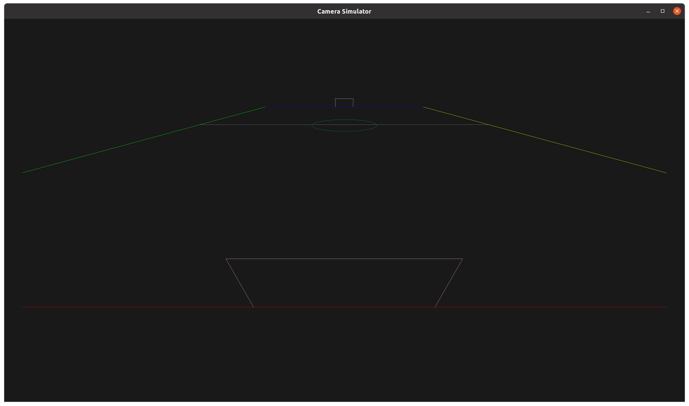

# Camera Simulator
A simulator for the camera field of view at various mounting positions and poses around a custom soccer field.

Usage:
```
python camera_simulator.py
```


# Requirements

## Install Python
- [Guide](https://www.digitalocean.com/community/tutorials/install-python-windows-10)
- [Python official Windows installer page](https://www.python.org/downloads/windows/)
  - Win64 installer for Python 3.10.11, the last version in 3.10 with an installer binary.
  - Make sure pip is installed too during the installation process by checking the “install pip” option.

## Install OpenGL's Python binding via pip

### Set domestic mirror for pip source
- [Guide](https://www.runoob.com/w3cnote/pip-cn-mirror.html)
  - On windows the config file location is ~/pip/pip.ini
  - Check configuration by `pip config list`. No need to restart anything after editing the config file.

### Install PyOpenGL
- [Guide](https://pyopengl.sourceforge.net/documentation/installation.html)
- `pip install PyOpenGL PyOpenGL_accelerate`
- Check installation by `python -c "import OpenGL"`; output should be empty indicating no error.

## Installing PyQt
- `pip install pyqt5`
- Check installation by `python -c "import PyQt5"`

